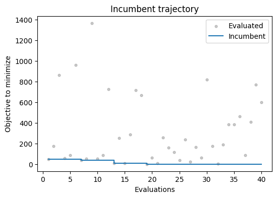
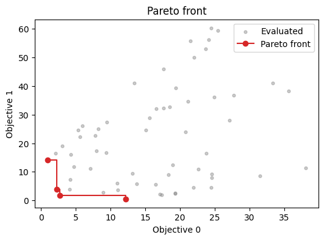
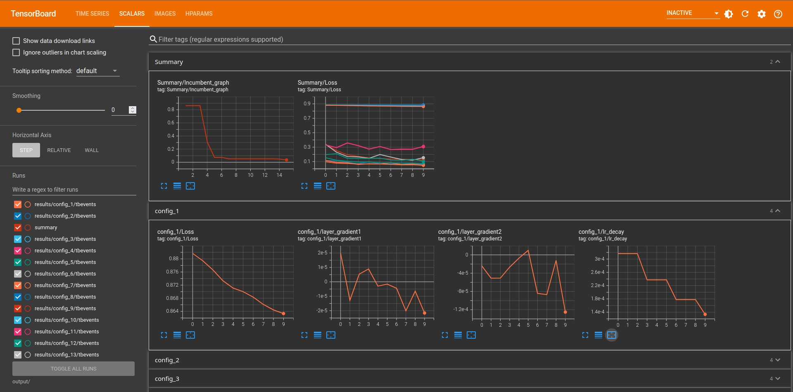
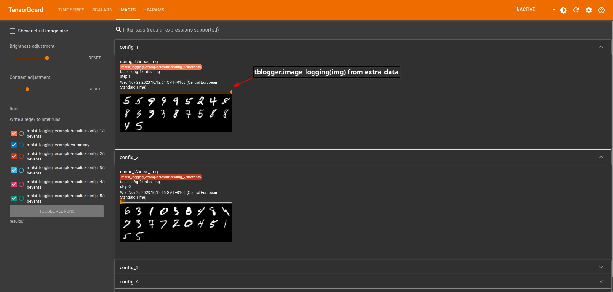
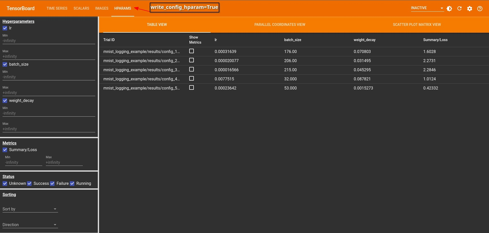
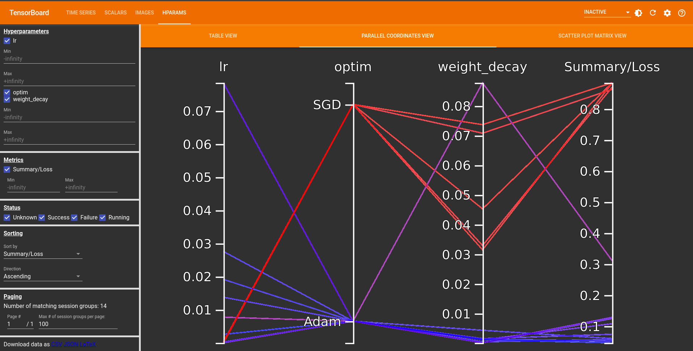
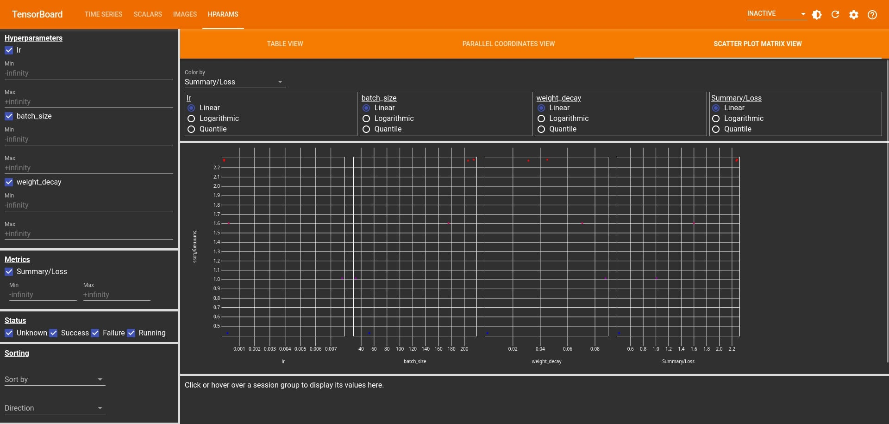

# Analysing Runs

Everything NePS knows about a run lives on disk, in the `root_directory` you gave to
[`neps.run()`][neps.api.run]. There are a few ways to look at it:

| You want to...                                                                  | Use                                                   |
| ------------------------------------------------------------------------------- | ----------------------------------------------------- |
| See how many trials are pending, running, done or crashed, and the best so far | [`neps.status`](#trial-status-nepsstatus)            |
| Get plots and CSV/text reports of the whole run, at any time                    | [`neps.analyze`](#plots-and-reports-nepsanalyze)     |
| Have those plots kept up to date while the run is going                         | [`live_plots=True`](#live-plots-during-a-run)         |
| Follow per-epoch metrics from inside your training loop                         | [TensorBoard](#tensorboard-integration)               |

## Trial status: `neps.status`

`neps.status` tells you where a run stands: how many trials are in each state, and the
best configuration found so far. It only reads the run; it does not write any files.

=== "CLI"

    ```bash
    python -m neps.status ROOT_DIRECTORY
    ```

=== "Python"

    ```python
    import neps

    full_df, short = neps.status("ROOT_DIRECTORY", print_summary=True)
    ```

    `full_df` has one row per trial (its config, report and metadata) and `short`
    summarizes the run as a whole: the same content as `summary/full.csv` and
    `summary/short.csv`.

!!! tip "Using `watch`"

    To show the status repeatedly, on unix systems you can use

    ```bash
    watch --interval 30 python -m neps.status ROOT_DIRECTORY
    ```

## Plots and reports: `neps.analyze`

[`neps.analyze()`][neps.api.analyze] rebuilds the `summary` folder of a run from what is
on disk: the CSVs, the best-config text files and the plots. It does not evaluate
anything, so you can call it

- after a run has finished, in particular one that ran without `live_plots=True`;
- while a run is still going, from another process or machine: it writes under the
  same lock as the workers;
- after collecting results asynchronously, or after
  [importing trials](import_trials.md).

```python
import neps

neps.analyze("ROOT_DIRECTORY")
```

### Which plots?

What NePS draws depends on how many objectives your `evaluate_pipeline` returns. Every
figure comes with a CSV of the exact points it shows, so you can re-plot them your own way.

| Objectives | Files in `summary/`                                    | Plot                                          |
| ---------- | ------------------------------------------------------ | --------------------------------------------- |
| 1          | `incumbent_trajectory.png`, `incumbent_trajectory.csv` | [Incumbent trajectory](#incumbent-trajectory) |
| 2          | `pareto_front.png`, `pareto_front.csv`                 | [Pareto front](#pareto-front)                 |
| 3 or more  | none                                                   | `best_config.txt` still lists the Pareto set  |

#### Incumbent trajectory

Every evaluated objective (grey) and the best one found so far (blue), against the
cumulative cost, or against the number of evaluations if `evaluate_pipeline` never
reported a cost.




#### Pareto front

Both objectives of every trial against each other (grey), with the non-dominated trials
joined up (red).




## Live plots during a run

Pass `live_plots=True` to have the plots
redrawn after every evaluated trial as well. Where to pass it depends on how your
trials are evaluated: via `neps.run()` or `neps.save_pipeline_results()` (see [the evaluate function](evaluate_pipeline.md)).

!!! warning "Overhead"

    Each refresh reads every trial and redraws the figures, so it gets slower as the run
    grows. Next to a training job of a few minutes this is negligible, but for many cheap
    evaluations, leave `live_plots` off and call `neps.analyze()` when you want to look.

## What's on disk?

NePS keeps several human-readable files in the `ROOT_DIRECTORY`, and a `summary` folder
with reports on the run.

```
ROOT_DIRECTORY
├── configs
│   ├── config_1                        # config_1_rung_0, ... for multi-fidelity
│   │   ├── config.yaml                 # The configuration
│   │   ├── metadata.json               # Its state, worker and timings
│   │   └── report.yaml                 # Its result, once evaluated
│   └── ...
├── summary
│   ├── full.csv                        # One row per trial
│   ├── short.csv                       # The run as a whole
│   ├── best_config.txt                 # The incumbent, or the Pareto set
│   ├── best_config_trajectory.txt      # Every config that became the incumbent
│   ├── incumbent_trajectory.{png,csv}  # 1 objective, with plots on
│   └── pareto_front.{png,csv}          # 2 objectives, with plots on
├── optimizer_info.yaml                 # The optimizer's configuration
├── optimizer_state.pkl                 # The optimizer's state, shared between workers
└── pipeline_space.pkl                  # The search space
```

`full.csv` has every trial's hyperparameters, together with whatever result and cost
`evaluate_pipeline` returned. `best_config_trajectory.txt` logs the incumbent trajectory
(single objective only) and `best_config.txt` records the current incumbent(s).


# TensorBoard integration

In NePS we replaced the traditional TensorBoard `SummaryWriter` with the `ConfigWriter` to streamline the logging process. This integration enhances the ability to visualize and diagnose hyperparameter optimization workflows, providing detailed insights into metrics and configurations during training.

### Overview of ConfigWriter

The `ConfigWriter` serves as a versatile and efficient tool for logging various training metrics and hyperparameter configurations. It seamlessly integrates with the NePS, enabling better visualization and analysis of model performance during hyperparameter searches.

To enable live logging of the incumbent trajectory, use the `write_summary_incumbent` argument when initializing `ConfigWriter`.

If a user only wishes to log the incumbent and does not want a specific writer for each configuration (i.e., no other logging in the run pipeline), they should simply trigger the `neps.tblogger.WriteIncumbent()` function in their run pipeline

### Example Usage

Below is an example implementation of the `ConfigWriter` for logging metrics during the training process:

```python
import neps
# Substitute the TensorBoard SummaryWriter with ConfigWriter from NePS
writer = neps.tblogger.ConfigWriter(write_summary_incumbent=True)

for i in range(max_epochs):
    objective_to_minimize = training(
        optimizer=optimizer,
        model=model,
        criterion=criterion,
        train_loader=train_loader,
        validation_loader=validation_loader,
    )

    # Gathering the gradient mean in each layer
    mean_gradient = []
    for layer in model.children():
        layer_gradients = [param.grad for param in layer.parameters()]
        if layer_gradients:
            mean_gradient.append(
                torch.mean(torch.cat([grad.view(-1) for grad in layer_gradients]))
            )

    ###################### Start ConfigWriter Logging ######################
    writer.add_scalar(tag="loss", scalar_value=objective_to_minimize, global_step=i)
    writer.add_scalar(
        tag="lr_decay", scalar_value=scheduler.get_last_lr()[0], global_step=i
    )
    writer.add_scalar(
        tag="layer_gradient1", scalar_value=mean_gradient[0], global_step=i
    )
    writer.add_scalar(
        tag="layer_gradient2", scalar_value=mean_gradient[1], global_step=i
    )

    scheduler.step()

    print(f"  Epoch {i + 1} / {max_epochs} Val Error: {objective_to_minimize} ")

# Logging hyperparameters and metrics
writer.add_hparams(
    hparam_dict={"lr": lr, "optim": optim, "wd": weight_decay},
    metric_dict={"loss_val": objective_to_minimize},
)
writer.close()
```

### Visualizing Results

The following command will open a local host for TensorBoard visualizations, allowing you to view them either in real-time or after the run is complete.

```bash
tensorboard --logdir path/to/root_directory
```

This image shows visualizations related to scalar values logged during training. Scalars typically include metrics such as loss, incumbent trajectory, a summary of losses for all configurations, and any additional data provided via the `extra_data` argument in the `tblogger.log` function.



This image represents visualizations related to logged images during training.
It could include snapshots of input data, model predictions, or any other image-related information.
In our case, we use images to depict instances of incorrect predictions made by the model.



The following images showcase visualizations related to hyperparameter logging in TensorBoard.
These plots include three different views, providing insights into the relationship between different hyperparameters and their impact on the model.

In the table view, you can explore hyperparameter configurations across five different trials.
The table displays various hyperparameter values alongside corresponding evaluation metrics.



The parallel coordinate plot offers a holistic perspective on hyperparameter configurations.
By presenting multiple hyperparameters simultaneously, this view allows you to observe the interactions between variables, providing insights into their combined influence on the model.



The scatter plot matrix view provides an in-depth analysis of pairwise relationships between different hyperparameters.
By visualizing correlations and patterns, this view aids in identifying key interactions that may influence the model's performance.


