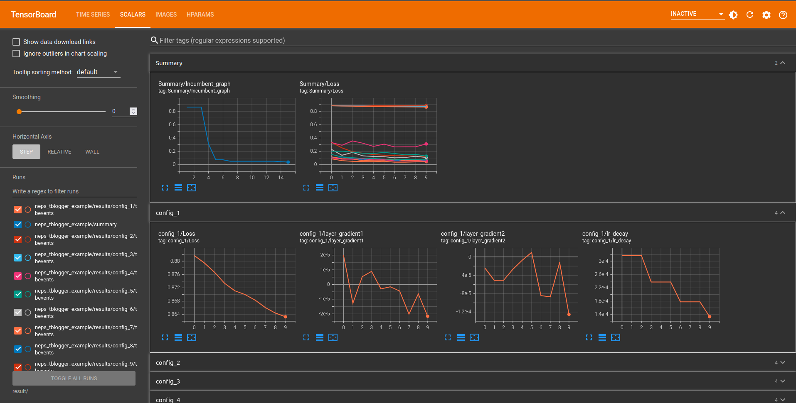
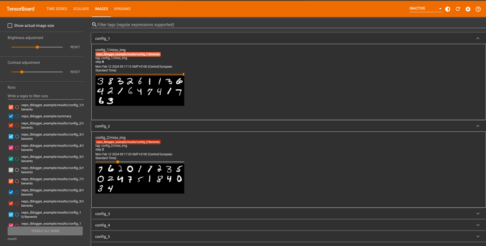
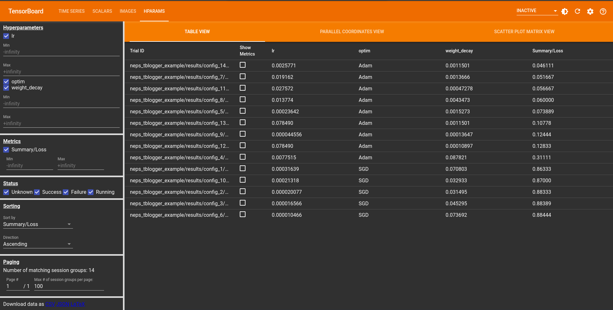
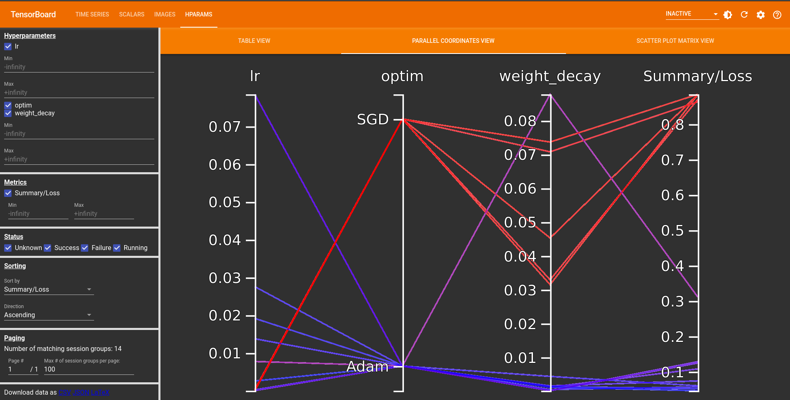

# Analysing Runs
NePS has some convenient utilities to help you to understand the results after you've run your runs.
All of the results and state are stored and communicated on disk, which you can access using
the `#!bash python -m neps.status ROOT_DIRECTORY` command or integrate live logging directly into your training loop
and visualize the results using TensorBoard.

To get a quick overview of the results, you can use the `#!bash python -m neps.plot ROOT_DIRECTORY` command.

## Status

To show status information about a neural pipeline search run, use

```bash
python -m neps.status ROOT_DIRECTORY
```

If you need more status information than is printed per default (e.g., the best config over time), please have a look at

```bash
python -m neps.status --help
```

!!! tip "Using `watch`"

    To show the status repeatedly, on unix systems you can use

    ```bash
    watch --interval 30 python -m neps.status ROOT_DIRECTORY
    ```

## CLI commands

To generate plots to the root directory, run

```bash
python -m neps.plot ROOT_DIRECTORY
```

Currently, this creates one plot that shows the best error value across the number of evaluations.

## What's on disk?
In the root directory, NePS maintains several files at all times that are human readable and can be useful
If you pass the `post_run_summary=` argument to [`neps.run()`][neps.api.run],
NePS will also generate a summary CSV file for you.

=== "`neps.run(..., post_run_summary=True)`"

    ```
    ROOT_DIRECTORY
    ├── results
    │  └── config_1
    │      ├── config.yaml
    │      ├── metadata.yaml
    │      └── result.yaml
    ├── summary_csv
    │  ├── config_data.csv
    │  └── run_status.csv
    ├── all_losses_and_configs.txt
    ├── best_loss_trajectory.txt
    └── best_loss_with_config_trajectory.txt
    ```


=== "`neps.run(..., post_run_summary=False)`"

    ```
    ROOT_DIRECTORY
    ├── results
    │  └── config_1
    │      ├── config.yaml
    │      ├── metadata.yaml
    │      └── result.yaml
    ├── all_losses_and_configs.txt
    ├── best_loss_trajectory.txt
    └── best_loss_with_config_trajectory.txt
    ```


The `config_data.csv` contains all configuration details in CSV format, ordered by ascending `loss`.
Details include configuration hyperparameters, any returned result from the `run_pipeline` function, and metadata information.

The `run_status.csv` provides general run details, such as the number of sampled configs, best configs, number of failed configs, best loss, etc.

## TensorBoard Integration
[TensorBoard](https://www.tensorflow.org/tensorboard) serves as a valuable tool for visualizing machine learning experiments,
offering the ability to observe losses and metrics throughout the model training process.
In NePS, we use this to show metrics of configurations during training in addition to comparisons of different hyperparameters used in the search for better diagnosis of the model.

### Logging Things

The [`tblogger.log()`][neps.plot.tensorboard_eval.tblogger.log] function is invoked
within the model's training loop to facilitate logging of key metrics.

We also provide some utility functions to make it easier to log things like:

* Scalars through [`tblogger.scalar_logging()`][neps.plot.tensorboard_eval.tblogger.scalar_logging]
* Images through [`tblogger.image_logging()`][neps.plot.tensorboard_eval.tblogger.image_logging]

You can provide these through the `extra_data=` argument in the `tblogger.log()` function.

For an example usage of all these features please refer to the [example](../examples/convenience/neps_tblogger_tutorial.md)!

```python
tblogger.log(
    loss=loss,
    current_epoch=i,
    write_summary_incumbent=False,  # Set to `True` for a live incumbent trajectory.
    writer_config_scalar=True,  # Set to `True` for a live loss trajectory for each config.
    writer_config_hparam=True,  # Set to `True` for live parallel coordinate, scatter plot matrix, and table view.

    # Name the dictionary keys as the names of the values
    # you want to log and pass one of the following functions
    # as the values for a successful logging process.
    extra_data={
        "lr_decay": tblogger.scalar_logging(value=scheduler.get_last_lr()[0]),
        "miss_img": tblogger.image_logging(image=miss_img, counter=2, seed=2),
        "layer_gradient1": tblogger.scalar_logging(value=mean_gradient[0]),
        "layer_gradient2": tblogger.scalar_logging(value=mean_gradient[1]),
    },
)
```

!!! tip

    The logger function is primarily designed for use within the `run_pipeline` function during the training of the neural network.

??? example "Quick Reference"

    === "`tblogger.log()`"

        ::: neps.plot.tensorboard_eval.tblogger.log

    === "`tblogger.scalar_logging()`"

        ::: neps.plot.tensorboard_eval.tblogger.scalar_logging

    === "`tblogger.image_logging()`"

        ::: neps.plot.tensorboard_eval.tblogger.image_logging

### Visualizing Results

The following command will open a local host for TensorBoard visualizations, allowing you to view them either in real-time or after the run is complete.

```bash
tensorboard --logdir path/to/root_directory
```

This image shows visualizations related to scalar values logged during training. Scalars typically include metrics such as loss, incumbent trajectory, a summary of losses for all configurations, and any additional data provided via the `extra_data` argument in the `tblogger.log` function.



This image represents visualizations related to logged images during training.
It could include snapshots of input data, model predictions, or any other image-related information.
In our case, we use images to depict instances of incorrect predictions made by the model.



The following images showcase visualizations related to hyperparameter logging in TensorBoard.
These plots include three different views, providing insights into the relationship between different hyperparameters and their impact on the model.

In the table view, you can explore hyperparameter configurations across five different trials.
The table displays various hyperparameter values alongside corresponding evaluation metrics.



The parallel coordinate plot offers a holistic perspective on hyperparameter configurations.
By presenting multiple hyperparameters simultaneously, this view allows you to observe the interactions between variables, providing insights into their combined influence on the model.



The scatter plot matrix view provides an in-depth analysis of pairwise relationships between different hyperparameters.
By visualizing correlations and patterns, this view aids in identifying key interactions that may influence the model's performance.


