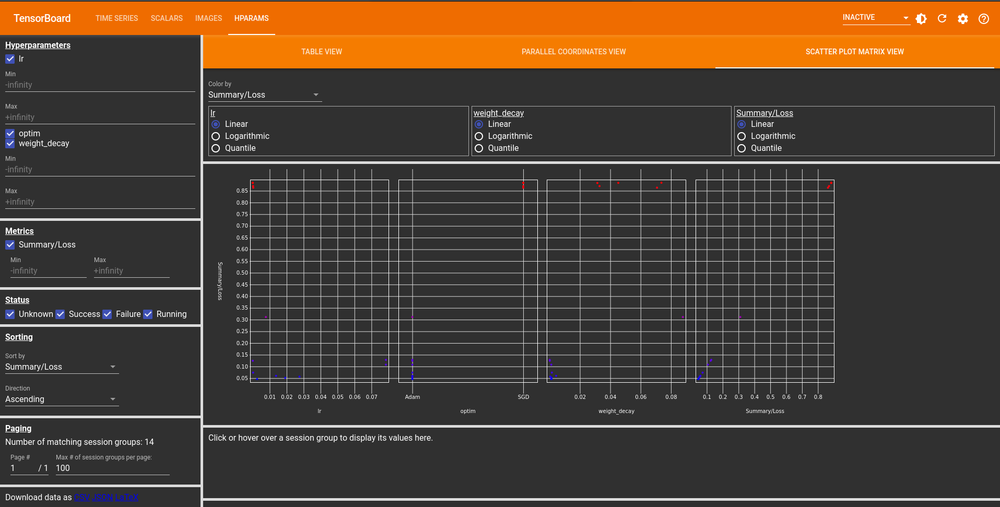

# Analysing Runs
NePS has some convenient utilities to help you to understand the results after you've run your runs.
All of the results and state are stored and communicated on disk, which you can access using
the `#!bash python -m neps.status ROOT_DIRECTORY` command or integrate live logging directly into your training loop
and visualize the results using TensorBoard.

To get a quick overview of the results, you can use the `#!bash python -m neps.plot ROOT_DIRECTORY` command.

## Status

To show status information about a neural pipeline search run, use

```bash
python -m neps.status ROOT_DIRECTORY
```

If you need more status information than is printed per default (e.g., the best config over time), please have a look at

```bash
python -m neps.status --help
```

!!! tip "Using `watch`"

    To show the status repeatedly, on unix systems you can use

    ```bash
    watch --interval 30 python -m neps.status ROOT_DIRECTORY
    ```

## CLI commands

To generate plots to the root directory, run

```bash
python -m neps.plot ROOT_DIRECTORY
```

Currently, this creates one plot that shows the best error value across the number of evaluations.

## What's on disk?
In the root directory, NePS maintains several files at all times that are human readable and can be useful
If you pass the `post_run_summary=` argument to [`neps.run()`][neps.api.run],
NePS will also generate a summary CSV file for you.

=== "`neps.run(..., post_run_summary=True)`"

    ```
    ROOT_DIRECTORY
    ├── results
    │  └── config_1
    │      ├── config.yaml
    │      ├── metadata.yaml
    │      └── result.yaml
    ├── summary_csv
    │  ├── config_data.csv
    │  └── run_status.csv
    ├── all_losses_and_configs.txt
    ├── best_loss_trajectory.txt
    └── best_loss_with_config_trajectory.txt
    ```


=== "`neps.run(..., post_run_summary=False)`"

    ```
    ROOT_DIRECTORY
    ├── results
    │  └── config_1
    │      ├── config.yaml
    │      ├── metadata.yaml
    │      └── result.yaml
    ├── all_losses_and_configs.txt
    ├── best_loss_trajectory.txt
    └── best_loss_with_config_trajectory.txt
    ```


The `config_data.csv` contains all configuration details in CSV format, ordered by ascending `loss`.
Details include configuration hyperparameters, any returned result from the `evalute_pipeline` function, and metadata information.

The `run_status.csv` provides general run details, such as the number of sampled configs, best configs, number of failed configs, best loss, etc.

# TensorBoard Integration

In NePS we replaced the traditional TensorBoard `SummaryWriter` with the `ConfigWriter` to streamline the logging process. This integration enhances the ability to visualize and diagnose hyperparameter optimization workflows, providing detailed insights into metrics and configurations during training.

## Overview of ConfigWriter

The `ConfigWriter` serves as a versatile and efficient tool for logging various training metrics and hyperparameter configurations. It seamlessly integrates with the NePS, enabling better visualization and analysis of model performance during hyperparameter searches.

To enable live logging of the incumbent trajectory, use the `write_summary_incumbent` argument when initializing `ConfigWriter`.

## Example Usage

Below is an example implementation of the `ConfigWriter` for logging metrics during the training process:

```python
import neps
# Substitute the TensorBoard SummaryWriter with ConfigWriter from NePS
writer = neps.tblogger.ConfigWriter(write_summary_incumbent=True)

for i in range(max_epochs):
    objective_to_minimize = training(
        optimizer=optimizer,
        model=model,
        criterion=criterion,
        train_loader=train_loader,
        validation_loader=validation_loader,
    )

    # Gathering the gradient mean in each layer
    mean_gradient = []
    for layer in model.children():
        layer_gradients = [param.grad for param in layer.parameters()]
        if layer_gradients:
            mean_gradient.append(
                torch.mean(torch.cat([grad.view(-1) for grad in layer_gradients]))
            )

    ###################### Start ConfigWriter Logging ######################
    writer.add_scalar(tag="loss", scalar_value=objective_to_minimize, global_step=i)
    writer.add_scalar(
        tag="lr_decay", scalar_value=scheduler.get_last_lr()[0], global_step=i
    )
    writer.add_scalar(
        tag="layer_gradient1", scalar_value=mean_gradient[0], global_step=i
    )
    writer.add_scalar(
        tag="layer_gradient2", scalar_value=mean_gradient[1], global_step=i
    )

    scheduler.step()

    print(f"  Epoch {i + 1} / {max_epochs} Val Error: {objective_to_minimize} ")

# Logging hyperparameters and metrics
writer.add_hparams(
    hparam_dict={"lr": lr, "optim": optim, "wd": weight_decay},
    metric_dict={"loss_val": objective_to_minimize},
)
writer.close()
```

### Visualizing Results

The following command will open a local host for TensorBoard visualizations, allowing you to view them either in real-time or after the run is complete.

```bash
tensorboard --logdir path/to/root_directory
```

This image shows visualizations related to scalar values logged during training. Scalars typically include metrics such as loss, incumbent trajectory, a summary of losses for all configurations, and any additional data provided via the `extra_data` argument in the `tblogger.log` function.


This image represents visualizations related to logged images during training.
It could include snapshots of input data, model predictions, or any other image-related information.
In our case, we use images to depict instances of incorrect predictions made by the model.


The following images showcase visualizations related to hyperparameter logging in TensorBoard.
These plots include three different views, providing insights into the relationship between different hyperparameters and their impact on the model.

In the table view, you can explore hyperparameter configurations across five different trials.
The table displays various hyperparameter values alongside corresponding evaluation metrics.


The parallel coordinate plot offers a holistic perspective on hyperparameter configurations.
By presenting multiple hyperparameters simultaneously, this view allows you to observe the interactions between variables, providing insights into their combined influence on the model.


The scatter plot matrix view provides an in-depth analysis of pairwise relationships between different hyperparameters.
By visualizing correlations and patterns, this view aids in identifying key interactions that may influence the model's performance.


