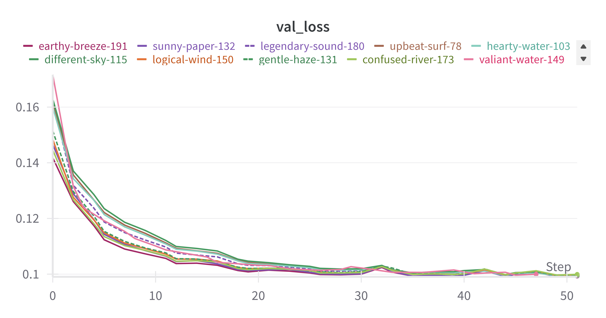

# Real World Examples

1. **Image Segmentation Pipeline Hyperparameter Optimization**

This example demonstrates how to perform hyperparameter optimization (HPO) for an image segmentation pipeline using NePS. The pipeline consists of a ResNet-50 model to segment images model trained on PASCAL Visual Object Classes (VOC) Dataset (http://host.robots.ox.ac.uk/pascal/VOC/).

We compare the performance of the optimized hyperparameters with the default hyperparameters. using the validation loss achieved on the dataset after training the model with the respective hyperparameters.

```bash
python3 image_segmentation_pipeline_hpo.py
```

The search space has been set with the priors set to the hyperparameters found in this base example: https://lightning.ai/lightning-ai/studios/image-segmentation-with-pytorch-lightning

We run the HPO process for 188 trials and obtain new set of hyperpamereters that outperform the default hyperparameters.

| Hyperparameter | Prior | Optimized Value |
|----------------|-------|-----------------|
| learning_rate  | 0.02 | 0.006745150778442621 |
| batch_size     | 4 | 5 |
| momentum       | 0.5 | 0.5844767093658447 |
| weight_decay   | 0.0001 | 0.00012664785026572645 |




The validation loss achieved on the dataset after training the model with the newly sampled hyperparameters is shown in the figure above.

We compare the validation loss values when the model is trained with the default hyperparameters and the optimized hyperparameters:

Validation Loss with Default Hyperparameters: 0.114094577729702

Validation Loss with Optimized Hyperparameters: 0.0997161939740181

The optimized hyperparameters outperform the default hyperparameters by 12.61%.