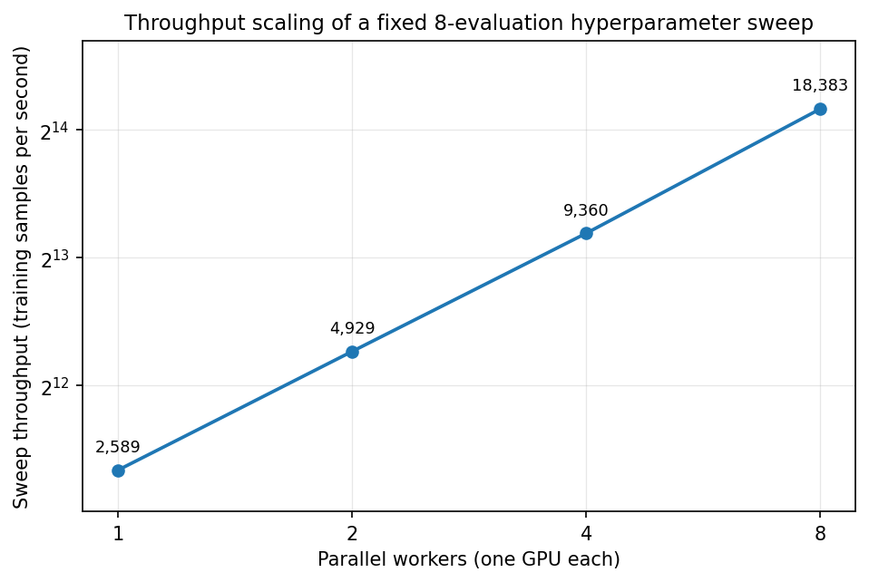

# Scaling study — how far does parallel HPO scale?

Not a search for the best model: a measurement of how much faster a *fixed* HPO
sweep finishes when it is given more parallel workers. The answer is what a
resource-grant proposal needs — how many GPUs, for how long.

## The setup

The same 8-evaluation sweep is run four times, split differently each time:

| Setting | `neps.run()` calls | `evaluations_to_spend` per call | Slurm jobs | GPUs |
|---|---|---|---|---|
| 1 worker  | 1 | 8 | 1 | 1 |
| 2 workers | 2 | 4 | 2 | 2 |
| 4 workers | 4 | 2 | 4 | 4 |
| 8 workers | 8 | 1 | 8 | 8 |

`evaluations_to_spend` is per `neps.run()` call, so all four settings complete
exactly 8 evaluations. Every worker is its own single-GPU Slurm job with its own
CPUs and memory; the workers of a setting share only a NePS root directory, which
is how they agree on who evaluates what. There is no DDP: one config trains on
one GPU.

Held identical across all four settings:

- **the configs.** The search space is a *grid* of exactly 8 points (`lr` × `wd`
  × `batch_size`, two choices each), so no setting can win by drawing cheaper
  configs.
- **the work.** 22.3M-parameter OpenCLIP, 100k LAION CC12M image/caption pairs,
  3 epochs, 1,165 optimizer steps per trial — 2,380,800 training samples per
  sweep, whatever the worker count.
- **the timing rule.** 5 warm-up steps before the clock starts; validation and
  checkpointing outside the timed loop.

The only variable is how many workers share the sweep.

## Results

Measured on NVIDIA H200 GPUs, one per worker.



| Workers | Sweep wall clock | Sweep throughput | Speedup | Efficiency | Median trial |
|---|---|---|---|---|---|
| 1 | 15.3 min | 2,589 samples/s | 1.00× | 100% | 2,855 samples/s |
| 2 |  8.0 min | 4,929 samples/s | 1.90× |  95% | 2,856 samples/s |
| 4 |  4.2 min | 9,360 samples/s | 3.62× |  90% | 2,862 samples/s |
| 8 |  2.2 min | 18,383 samples/s | 7.10× |  89% | 2,857 samples/s |

Sweep throughput is all 2,380,800 samples over the wall clock of the whole
sweep, `max(time_end) - min(time_started)`.

## What the numbers say

**A worker's own speed is untouched by how many other workers are running.**
The median trial holds at ~2,856 samples/s from 1 worker to 8 — a 0.2% spread.
What spread there is comes from batch size, not interference: `batch_size=512`
trials run at ~2,954 samples/s and `batch_size=256` at ~2,763, in every setting
alike. Since each worker has its own allocation, nothing is shared to contend
over.

**Scaling is therefore near-linear, and the whole deficit is job start skew.**
Workers are independent Slurm jobs, so they do not begin at the same instant:
the last worker of a setting started 25.6 s after the first at 2 and 4 workers,
11.9 s at 8. That single term accounts for the gap to the ideal line:

| Workers | Ideal (15.3 min ÷ n) | + start skew | Measured |
|---|---|---|---|
| 2 | 459.8 s | 485.4 s | 483.0 s |
| 4 | 229.9 s | 255.5 s | 254.4 s |
| 8 | 115.0 s | 126.9 s | 129.5 s |

`wall(n) ≈ wall(1)/n + skew` predicts every measurement to within 3 s. The cost
of parallelising this search is a fixed handful of seconds, not a per-worker
tax — so it shrinks in relative terms with longer trials and grows with shorter
ones.

**Each trial also carries ~10–13 s of untimed work** — dataset load, model
build, warm-up steps, validation — inside the sweep's wall clock but outside the
timed loop. That is why sweep throughput (2,589 samples/s at 1 worker) sits
below single-trial throughput (2,855). It is a constant per trial, so it is
already in the 1-worker baseline and does not affect the speedups.

**For a proposal**: at this trial length, 8 workers deliver 7.1× and there is no
sign of a knee. Efficiency drifts from 95% to 89% only because a fixed startup
skew is being amortised over an ever-shorter sweep; the per-GPU work rate never
moves. Scaling further is a question of queue capacity, not of diminishing
returns from the search itself.

## Running it

```bash
python ../download_data.py --n_samples 102000   # if the cache is smaller than the study needs
python run_scaling_study.py                     # submits all 15 worker jobs
python visualization.py                         # -> ../results/scaling_study/summary/
```

- `run_scaling_study.py` — submits one Slurm job per worker.
- `worker.py` — one job's `neps.run()` on the setting's shared root directory.
- `train.py` — trains and times one config on one GPU.
- `visualization.py` — aggregates the four sweeps into the figure and tables.

Results land in `../results/scaling_study/workers_<n>/` (NePS state, one per
setting), `../results/scaling_study/jobs/` (job scripts and Slurm logs) and
`../results/scaling_study/summary/` (the table and figure of your own run). The
`scaling_study.png` shown above is the reference run recorded here, and is not
overwritten by re-running the study.

Two ordering details matter when reproducing this. `NePSState.create_or_load`
does not lock its creation path, so the first worker of a setting is submitted
alone and the rest with `--dependency=after:<its job id>`; they then wait for
`pipeline_space.pkl`, the last file state creation writes, before starting.
Nothing but NePS may write into a `workers_<n>/` directory.

Set the partition, memory and time limit in `run_scaling_study.py` for your own
cluster before running; the `#CHANGE_ME` markers flag everything that is site- or
study-specific.
